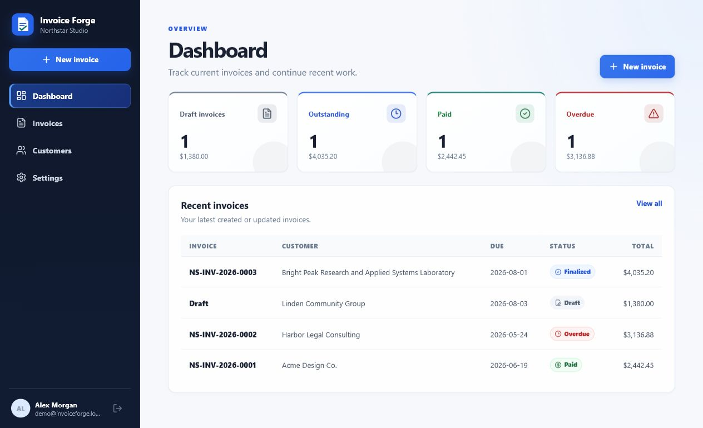

# Invoice Forge

Invoice Forge is a full-stack invoicing application for freelancers and small businesses. It provides tenant-scoped customer and invoice management, decimal-safe financial calculations, transactional invoice numbering, immutable finalized invoices, audit history, and server-generated PDFs.

## Live preview

**Public showcase:** [Open Invoice Forge in your browser](https://invoice-forge-preview.johnandreiyalong.chatgpt.site)

[](https://invoice-forge-preview.johnandreiyalong.chatgpt.site)

The public showcase presents the real seeded dashboard and invoice editor. The authenticated application, API, database, and PDF workflows run locally from this repository.

## Features

- Owner registration, sign-in, sign-out, and HTTP-only sessions
- Tenant-isolated business settings, customers, tax rates, invoices, and PDFs
- Customer create, edit, archive, restore, and search workflows
- Draft create, edit, save, delete, duplicate, and cancel workflows
- Transactional, year-based invoice numbering
- Finalize, mark paid, overdue, void, and audit-event workflows
- Immutable business, customer, and calculation snapshots after finalization
- Decimal-safe discounts, inclusive or exclusive taxes, and currency-aware rounding
- Searchable and filterable invoice history
- Draft PDF preview and finalized PDF download
- Responsive, keyboard-accessible React interface

## Requirements

- Node.js 22.12 or newer
- npm 11 or newer
- Playwright Chromium for PDF and browser testing

Docker Desktop is optional.

## Local setup

1. Copy the environment template.

   Windows PowerShell:

   ```powershell
   Copy-Item .env.example .env
   ```

   macOS or Linux:

   ```bash
   cp .env.example .env
   ```

2. Install dependencies and Chromium.

   ```bash
   npm ci
   npm exec playwright install chromium
   ```

3. Generate Prisma Client, apply committed migrations, and load demo data.

   ```bash
   npm run setup
   ```

4. Start the API and web app.

   ```bash
   npm run dev
   ```

Open `http://localhost:5173`. The API and health endpoint are available at `http://localhost:3001` and `http://localhost:3001/health`.

### Demo credentials

- Email: `demo@invoiceforge.local`
- Password: `demo1234`

The deterministic seed includes draft, finalized, paid, overdue, discounted, inclusive-tax, and multi-page invoice examples. Running `npm run db:seed` replaces local demo data.

## Environment

| Variable              | Required | Default                         | Purpose                      |
| --------------------- | -------- | ------------------------------- | ---------------------------- |
| `NODE_ENV`            | No       | `development`                   | Runtime mode                 |
| `DATABASE_URL`        | Yes      | `file:./dev.db` in the template | Prisma SQLite database       |
| `API_PORT`            | No       | `3001`                          | API listen port              |
| `WEB_ORIGIN`          | Yes      | `http://localhost:5173`         | Allowed browser origin       |
| `SESSION_COOKIE_NAME` | No       | `invoice_session`               | Session cookie name          |
| `SESSION_TTL_DAYS`    | No       | `7`                             | Session lifetime             |
| `PDF_STORAGE_DIR`     | No       | `./data/pdfs`                   | Generated PDF directory      |
| `CHROMIUM_PATH`       | No       | Playwright-managed Chromium     | Explicit Chromium executable |

Relative database paths follow Prisma's schema location. Relative PDF paths are resolved from the repository root.

## Project Commands

Use these commands for this repo:

- Install: `npm ci`
- Dev: `npm run dev`
- Build: `npm run build`
- Test: `npm test`
- End-to-end test: `npm run test:e2e`
- Lint: `npm run lint`
- Type-check: `npm run typecheck`
- Format: `npm run format`
- Format check: `npm run format:check`
- Generate Prisma Client: `npm run db:generate`
- Apply migrations: `npm run db:deploy`
- Seed demo data: `npm run db:seed`
- Complete database setup: `npm run setup`

The end-to-end command starts the application automatically when it is not already running.

## Docker

```bash
docker compose up --build -d
docker compose exec api npm run db:seed
```

Open `http://localhost:8080`. The `invoice_data` volume stores SQLite data and PDFs. Stop the stack with `docker compose down`; add `--volumes` only when you intentionally want to delete persisted data.

## Repository structure

```text
apps/
  api/               Fastify API, authentication, persistence, and PDF delivery
  web/               React application and visual system
packages/
  contracts/         Shared Zod request contracts
  domain/            Decimal financial calculations and lifecycle rules
prisma/              Schema, committed migration, and deterministic seed
e2e/                 Playwright full-lifecycle browser test
docs/                Architecture, security, calculation, testing, and UI notes
docker/              Production API and web images
```

## Financial and lifecycle guarantees

Financial inputs cross API boundaries as validated decimal strings. Decimal.js performs arithmetic at high precision; currency rounding happens explicitly at the configured 0-, 2-, 3-, or 4-decimal scale. Invoice-level fixed discounts use largest-remainder allocation so the allocated minor units always match the requested discount.

Finalization runs in a transaction: it revalidates the draft version, recalculates totals on the server, reserves the next business/year sequence, writes permanent snapshots, locks financial editing, and appends an audit event. A finalized invoice is corrected by voiding and duplicating it, never by rewriting its historical amounts.

See [calculation rules](docs/calculations.md), [architecture](docs/architecture.md), and [security decisions](docs/security.md).

## Production notes

The included SQLite database and local PDF storage are suitable for a local or single-instance deployment. A horizontally scaled hosted deployment should use PostgreSQL, private object storage, managed secrets, backups, and a background PDF/email job queue. `Paid` is currently a controlled invoice status rather than a payment ledger; email delivery, public customer links, credit notes, and payment processing are intentionally out of scope.

## License

MIT
